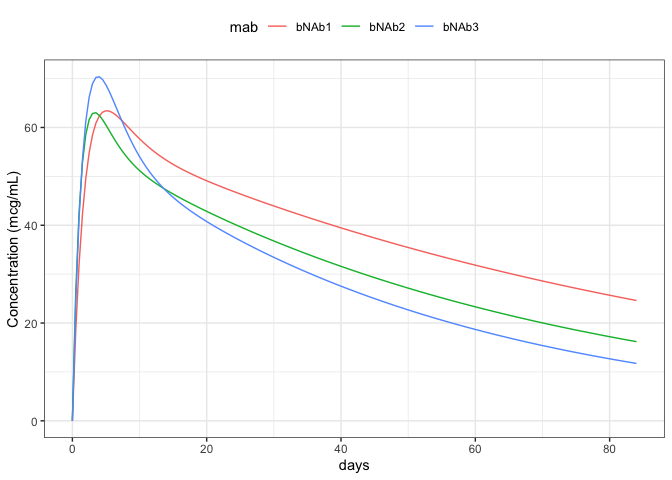
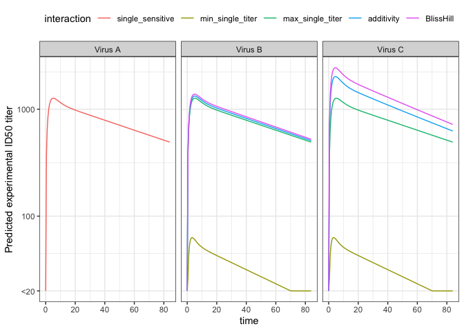

<!-- -->

<table class="table" style="width: auto !important; margin-left: auto; margin-right: auto;">
 <thead>
<tr>
<th style="border-bottom:hidden" colspan="1"></th>
<th style="border-bottom:hidden; padding-bottom:0; padding-left:3px;padding-right:3px;text-align: center; " colspan="3">
IC50
</th>
<th style="border-bottom:hidden" colspan="1"></th>
</tr>
  <tr>
   <th style="text-align:left;"> virus </th>
   <th style="text-align:right;"> bNAb1 </th>
   <th style="text-align:right;"> bNAb2 </th>
   <th style="text-align:right;"> bNAb3 </th>
   <th style="text-align:left;"> description </th>
  </tr>
 </thead>
<tbody>
  <tr>
   <td style="text-align:left;"> A </td>
   <td style="text-align:right;"> 0.05 </td>
   <td style="text-align:right;"> 0 </td>
   <td style="text-align:right;"> 0.0 </td>
   <td style="text-align:left;"> single sensitivity </td>
  </tr>
  <tr>
   <td style="text-align:left;"> B </td>
   <td style="text-align:right;"> 0.05 </td>
   <td style="text-align:right;"> 1 </td>
   <td style="text-align:right;"> 0.0 </td>
   <td style="text-align:left;"> double sensitive </td>
  </tr>
  <tr>
   <td style="text-align:left;"> C </td>
   <td style="text-align:right;"> 0.05 </td>
   <td style="text-align:right;"> 1 </td>
   <td style="text-align:right;"> 0.1 </td>
   <td style="text-align:left;"> triple sensitive </td>
  </tr>
</tbody>
</table>

<!-- -->
